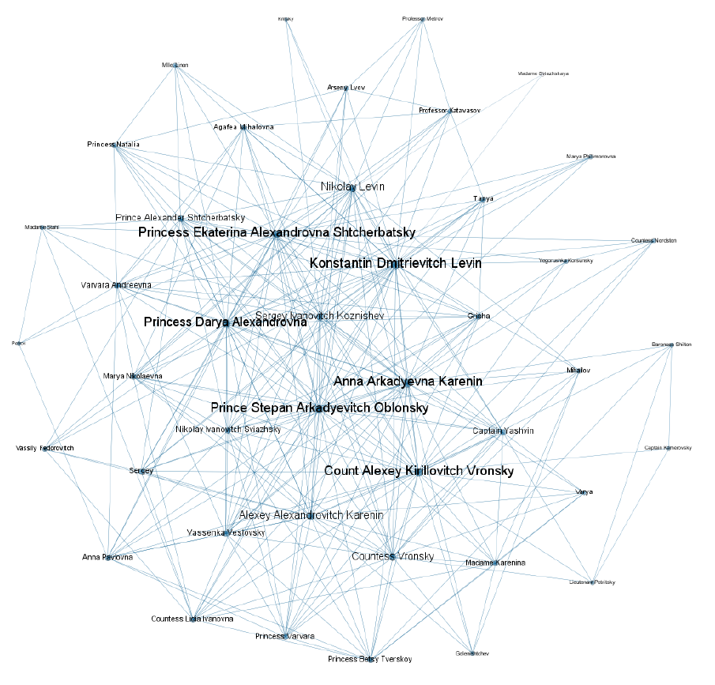

# Abstract:

Anna Karenina is a very long novel by the Russian author Count Leo Tolstoy. Anna Karenina is
admired by many novelists and bibliophiles as the world's most remarkable novel, and it provides a vast
panorama of contemporary life in Russia and that of humanity in general. The author perfectly puts
all his efforts into bringing astonishing characters into being and gripping the readers with his fanciful
aristocratic love-story. The story mostly revolves around Anna Arkadyevna Karenin, Alexey's wife, who
finds the Count Vronsky as her lover to consummate her passionate affairs. In this project, we accomplish
a Network-Based study on the novel "Anna Karenina". We create a co-occurrence network such that the
characters are linked if they are mentioned in the same paragraph at least once. Our resulting network
consists of 45 actors and 289 links. Our network is in some respects analogous to the Barabasi-Albert
network model with the same node number and average degree; they both represent a high average
clustering coefcient, degree disassortativity, and inseparable community structure. Furthermore, the
network seems to be randomly mixed according to the gender of the characters. Such an observation
may spring from the fact that the story of the novel is a medley of love, secret love, and different-sex
contact. Also, using greedy algorithm and independent cascade model, we found out that Prince Stepan
Arkadyevitch Oblonsky and Prince Alexander Shtcherbatsky are two most infuential actors in the network
who can impact 18.48 actors on average.

